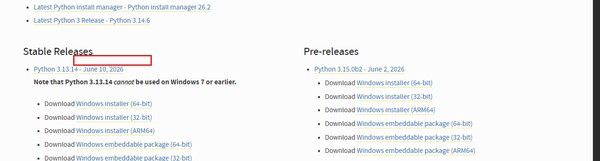
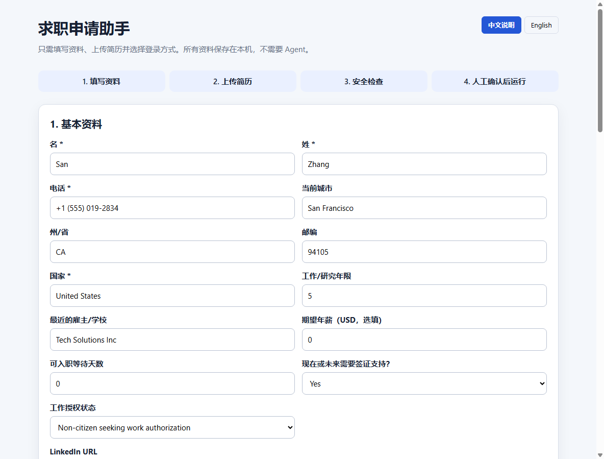

# 新手快速开始（Windows）

这个项目现在提供一个本地控制中心。用户不需要编辑 Python 文件，也不需要
Codex、ChatGPT 或其他 Agent。

## 使用前准备

1. **安装 Google Chrome 浏览器**：
   - 访问 [Google Chrome 官网](https://www.google.com/chrome/)，点击蓝色 **【下载 Chrome】** 按钮进行安装。
2. **安装 Python 3.10 或更新版本**：
   - 访问 [Python 官网下载页面](https://www.python.org/downloads/)，下载适用于 Windows 的 Python 安装程序。
   - 运行安装程序时，**务必在弹出的安装界面最下方勾选 “Add python.exe to PATH”**（将 Python 添加到系统环境变量），然后再点击顶部的 **【Install Now】**。
   
   

3. **一份准备好的 PDF 简历**。

## 第一次运行与控制台界面

1. **下载本仓库代码**：
   - 在本项目的 GitHub 页面中，点击绿色的 **【Code】** 按钮，然后在下拉菜单中点击最下方的 **【Download ZIP】**。
   
   
   
2. **解压 ZIP 压缩包**：
   - 下载完成后，将 ZIP 压缩包解压到一个独立的文件夹中。**注意：绝对不能直接在压缩包中双击运行**。
3. 双击运行：
   ```text
   START_HERE.bat
   ```

首次运行会自动创建独立环境并安装组件。安装完成后，浏览器会自动打开本地控制中心：
```text
http://127.0.0.1:5050
```



### 🖱️ 各核心步骤与点击操作说明：

*   **第 1 步：填写基本资料与求职目标**
    *   在界面中填写您的姓名、电话、国家，并设置**目标岗位**和**搜索地点**。
    *   填写完成后，点击 **【保存资料】** 按钮。这会将信息安全保存到本机的 `user_data/profile.json` 中。
*   **第 2 步：上传简历**
    *   **上传 PDF 简历**：点击选择您的 PDF 文件，然后点击 **【上传 PDF 简历】**。
    *   **启用 AI 简历定制（可选）**：如果您勾选了下方的 **“一公司一简历 (AI 自动润色)”**，网页会动态在中间滑出 **“3.1 上传 Word 格式母版简历”** 的区域。点击选择您的 `.docx` 母版简历，并点击 **【上传 Word 母版简历】**。
*   **第 3 步：设定投递与定制选项**
    *   **一公司一简历**：AI 会根据岗位 JD 自动润色 Word 简历的项目描述。
    *   **仅收录不投递**：只收录岗位并自动生成简历到本地，不在 LinkedIn 真正申请。
    *   **一键全自动投递**：全自动确认提交。不勾选则在最后一步暂停，由您人工核对后手动点击提交。
*   **第 4 步：安全检查（Preflight Checks）**
    *   页面会自动运行检查项（包括 Chrome 浏览器、资料完整性、简历文件存在性等）。
    *   **所有检查项必须显示绿色（正常）** 且上方提示“准备完成，可以启动”，才允许运行。
*   **第 5 步：登录并启动**
    *   选择您的 LinkedIn 登录方式（手动登录 / 自动填写）。
    *   在文本框中输入大写：`REVIEW`。
    *   最后，点击 **【启动申请助手】** 开始自动化。如需中断，点击旁边的红色 **【停止】** 按钮。

## 用户需要提供什么

在页面中填写：

- 姓名、电话、城市和国家
- 工作授权和签证情况
- LinkedIn、GitHub 或个人网站
- 目标岗位和搜索地点
- PDF 简历

然后选择 LinkedIn 登录方式：

1. **手动登录（推荐）**：浏览器打开后自行登录，不保存密码。
2. **本次自动填写**：账号和密码只传给当前运行的子进程，不写入配置文件。

## 安全运行

页面必须显示所有检查通过，才允许启动。

启动前输入：

```text
REVIEW
```

新手模式会强制：

- 浏览器可见
- 每份申请提交前暂停
- 不在后台连续运行
- 不自动关注公司
- 缺少 PDF 简历时禁止启动

自动化可以填写真实申请表，但最终内容必须由用户检查。

## 停止

- 点击本地页面中的“停止”；或者
- 关闭自动化浏览器窗口；或者
- 在黑色启动窗口按 `Ctrl+C`

## 资料保存位置

非敏感求职资料与简历保存在：

```text
user_data/
```

该目录已被 Git 忽略。LinkedIn 密码默认不保存。

不要公开：

- `user_data/`
- `config/secrets.py`
- `config/personals.py`
- 浏览器资料目录
- 简历、申请记录和 API Key

## 常见问题

### 没有自动打开页面

在浏览器手动访问 <http://127.0.0.1:5050>。

### Python was not found

重新安装 Python，勾选 **Add Python to PATH**，重启电脑后再次双击。

### 安装组件失败

检查网络、防火墙和 VPN，然后重新运行 `START_HERE.bat`。

### LinkedIn 要求验证码

手动完成验证。不要尝试绕过验证码或账户安全检查。

### LinkedIn 页面变化后无法填写

立即停止自动化。平台页面变化可能使浏览器自动化失效，不能无人值守运行。
