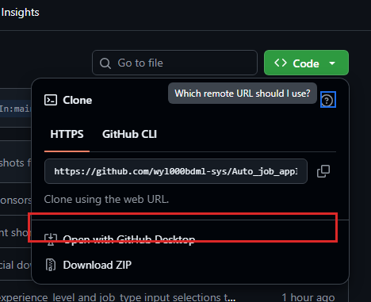
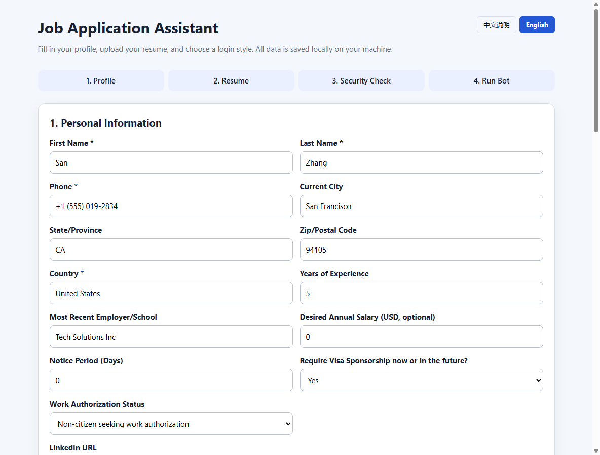

# Beginner Quick Start (macOS)

This project ships with a local control center. You don't need to edit any
Python files, and you don't need Codex, ChatGPT, or any other agent.

> **中文版**：请参阅 [QUICKSTART_MAC_ZH.md](QUICKSTART_MAC_ZH.md)。
> **Windows users**: see [QUICKSTART.md](QUICKSTART.md).

## Before you start

1. **Install Google Chrome**:
   - Go to the [Google Chrome site](https://www.google.com/chrome/) and click the
     blue **Download Chrome** button to install it.
   - **Drag Google Chrome into the Applications folder.** Don't run it straight
     from the disk image (`.dmg`) or the Downloads folder, or the safety check
     may report that Chrome is not installed.
2. **Install Python 3.10 or newer**:
   - Go to the [Python downloads page for macOS](https://www.python.org/downloads/macos/)
     and download the latest macOS installer (`.pkg`).
   - Double-click the `.pkg` file and follow the default steps. Once finished,
     Python is configured automatically — **no environment-variable setup is
     needed**.

   > **Verify the install**: open **Terminal** and run the command below. If a
   > version number appears, the install succeeded:
   > ```bash
   > python3 --version
   > ```

3. **A ready-to-use PDF resume.**

## First run and the control center

1. **Download this repository**:
   - On this project's GitHub page, click the green **Code** button, then click
     **Download ZIP** at the bottom of the dropdown.

   

2. **Unzip the archive**:
   - After downloading, double-click the ZIP to extract it into a folder.
     **Never run a script from inside the archive — extract it first.**

3. **Launch the program**:
   - In Finder, find the extracted folder, **right-click** `START_HERE.command`
     and choose **Open**.
   - If macOS shows "cannot be opened because the developer cannot be verified",
     click the **Open** button (this only appears on the first run).

   > **Tip**: don't just double-click `START_HERE.command`. The first run must be
   > right-click → Open, otherwise macOS Gatekeeper blocks it.

The first run automatically does the following in the background:
- creates an isolated Python virtual environment (`.venv/`)
- installs all required components

When setup finishes, your browser opens the local control center:
```text
http://127.0.0.1:5050
```

> **Note**: keep the Terminal window open. Closing it stops the service.



### 🖱️ What each step does:

*   **Step 1: Fill in basic info and job targets**
    *   Enter your name, phone, and country, then set your **target roles** and
        **search location**.
    *   When done, click **Save profile**. This safely stores the data in
        `user_data/profile.json` on your machine.
*   **Step 2: Upload your resume**
    *   **Upload PDF resume**: choose your PDF file, then click **Upload PDF resume**.
    *   **Enable AI resume tailoring (optional)**: if you check **"One resume per
        company (AI auto-tailoring)"**, the page slides out a **"3.1 Upload Word
        master resume"** area. Choose your `.docx` master resume and click
        **Upload Word master resume**.
*   **Step 3: Set submission and tailoring options**
    *   **One resume per company**: the AI tailors the project descriptions in your
        Word resume based on the job description.
    *   **Collect only, don't submit**: only collects jobs and generates resumes
        locally without actually applying on LinkedIn.
    *   **Fully automatic submission**: confirms and submits automatically. If
        unchecked, it pauses at the final step for you to review and submit manually.
*   **Step 4: Preflight checks**
    *   The page automatically runs checks (Chrome, profile completeness, resume
        file presence, etc.).
    *   **Every check must be green** and the banner must say it's ready before you
        can run.
*   **Step 5: Log in and launch**
    *   Choose your LinkedIn login method (manual login / auto-fill).
    *   Type the uppercase word `REVIEW` in the text box.
    *   Finally, click **Start the assistant** to begin automation. To interrupt,
        click the red **Stop** button next to it.

## What you need to provide

Fill in on the page:

- name, phone, city, and country
- work authorization and sponsorship status
- LinkedIn, GitHub, or personal website
- target roles and search location
- a PDF resume

Then choose a LinkedIn login method:

1. **Manual login (recommended)**: log in yourself in the opened browser; no
   password is saved.
2. **Auto-fill for this run**: your username and password are passed only to the
   current child process and are never written to the config file.

## Running safely

The page must show all checks passing before you can start.

Before launch, type:

```text
REVIEW
```

Beginner mode always:

- keeps the browser visible
- pauses before every submission
- never runs continuously in the background
- never auto-follows companies
- blocks startup when the PDF resume is missing

The automation can fill in real application forms, but the final content must be
reviewed by you.

## Stopping

- Click "Stop" on the local page; or
- close the automation browser window; or
- press `Ctrl+C` in the Terminal window.

## Where your data is stored

Non-sensitive job data and resumes are stored in:

```text
user_data/
```

This directory is Git-ignored. Your LinkedIn password is not saved by default.

Do not publish:

- `user_data/`
- `config/secrets.py`
- `config/personals.py`
- browser profile directories
- resumes, application records, and API keys

## FAQ

### The page didn't open automatically

Open <http://127.0.0.1:5050> in your browser manually.

### "Cannot be opened because the developer cannot be verified"

This is a normal macOS Gatekeeper prompt. To handle it:
1. **Right-click** `START_HERE.command`
2. Choose **Open**
3. Click the **Open** button in the dialog

You only need to do this once; afterward you can double-click to run.

### Python not found / `python3` command not found

Run in Terminal:
```bash
python3 --version
```
If it says "command not found", Python isn't installed correctly. Re-download the
installer from [python.org](https://www.python.org/downloads/macos/) and install
with the default options.

### Installing components failed (pip error)

Check your network connection, then run manually in Terminal:
```bash
cd /path/to/Auto_job_applier_linkedIn
bash setup-for-beginners.sh
```

### Chrome not recognized (safety check fails)

Make sure Google Chrome is installed (not Chromium or another browser) and that
it's in **Applications**. The default location is `/Applications/Google Chrome.app`.

### LinkedIn asks for a CAPTCHA

Complete the verification manually. Do not try to bypass CAPTCHAs or account
security checks.

### Filling fails after LinkedIn changes its pages

Stop the automation immediately. Platform page changes can break browser
automation, and it must not run unattended.
