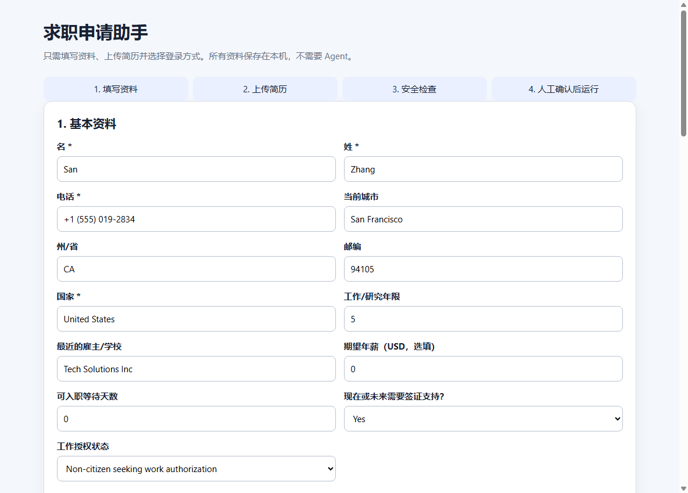

# 本地求职申请助手 (定制增强版)

[English](README.md) | [中文说明](README_ZH.md)



这是一个本地运行的求职申请自动化助手，修改自开源项目 [GodsScion/Auto_job_applier_linkedIn](https://github.com/GodsScion/Auto_job_applier_linkedIn)（基于 AGPLv3 协议开源）。

## 🚀 核心定制与升级功能

本分支针对**学术/科研方向求职（如 Ph.D.、博后、科研岗）**以及**初学者友好体验**引入了以下多项核心重构与升级：

1. **本地网页控制中心：** 新增基于 Flask 的本地网页控制台（运行在 `127.0.0.1:5050`）。用户无需编写或修改任何 Python 代码，即可在浏览器界面中完成个人信息填写、上传 PDF 简历、配置搜索关键词以及设定登录方式。
2. **AI 智能适岗度评估（大脑升级）：** 深度集成 Google Gemini API。在投递任何岗位前，大模型会自动读取岗位描述（JD），并将其与你专属的 **Ph.D./科研项目经验库**（`career_project_inventory.md`）进行智能匹配。算法会计算出 0-100 的适岗度得分并给出评估理由。如果评分低于 50 分或 AI 决定跳过（Skip），机器人将自动跳过该岗位，从而大幅降低无效申请风险，避免账号因盲目高频投递被封。
3. **定制化开放式问答：** 在遇到申请表中的主观陈述题（如“为什么你适合本岗位？”、“自我介绍”或“Cover Letter”）时，AI 会根据当前的岗位描述自动生成专属的定制文本（`current_job_summary`）并自动填入。
4. **持久化失败/跳过记忆：** 在初始化时会自动读取已投递历史（Applied）和失败/跳过历史（Failed/Skipped）记录。一旦遇到之前投递失败或因不匹配而被跳过的 Job ID，将直接滤除，杜绝重复打开。
5. **Windows Chrome 版本自适应匹配：** 自动检测 Windows 系统中实际安装的 Google Chrome 浏览器主版本（如 `149`），并在启动时强制 `undetected-chromedriver` 匹配该版本下载驱动，彻底解决了因浏览器自动更新导致的驱动版本不匹配崩溃问题。

---

## 🛠️ 快速开始

1. 安装 [Google Chrome 浏览器](https://www.google.com/chrome/)。
2. 安装 [Python 3.10+](https://www.python.org/downloads/)，安装时务必勾选 **Add Python to PATH**（将 Python 添加到系统环境变量）。
3. 下载并解压本仓库代码。
4. 双击运行根目录下的：
   ```text
   START_HERE.bat
   ```
5. 脚本会自动为你创建 Python 虚拟环境（`.venv`），安装必要的依赖包，并自动在浏览器中打开本地配置页面：`http://127.0.0.1:5050`。

*详细的新手中文使用指南，请参阅 [QUICKSTART.md](QUICKSTART.md)。*

---

## 📋 用户需要提供什么

*   联系方式与个人定位信息。
*   工作授权与身份/签证赞助状态。
*   目标求职意向及搜索地点。
*   LinkedIn / 个人作品集链接。
*   一份 PDF 格式的个人简历。
*   LinkedIn 登录选择。

*(推荐使用**手动登录**模式。如果你选择在本地网页中输入账号密码，密码仅会在本次运行期间直接传递给子进程，绝不会写入任何本地 JSON 配置文件或上传至网络，确保隐私安全。)*

---

## 🔒 安全保障与默认限制

初学者模式会强制执行以下安全限制，以防被平台检测为恶意爬虫：

*   **浏览器全程可见**，不允许隐藏后台运行。
*   **最终提交前强制暂停**，必须由用户人工核对无误后点击确认才会提交。
*   **禁止不间断的后台循环运行**。
*   **关闭自动关注公司**功能。
*   启动前进行预飞安全检查（如必须检测到 PDF 简历且用户手动在网页输入 `REVIEW` 确认后方可启动）。

---

## 📐 系统架构

```text
START_HERE.bat
  -> setup-for-beginners.ps1 (环境检测与配置)
  -> beginner_app.py (本地 Flask 网页 API，仅限 127.0.0.1)
  -> user_data/profile.json + 简历文件 (本地非敏感配置)
  -> preflight safety checks (安全预飞检查)
  -> runAiBot.py (Selenium 自动化引擎执行)
```

详细的设计文档请参阅 [docs/ARCHITECTURE.md](docs/ARCHITECTURE.md)。

---

## 🚫 隐私声明：切勿公开的文件

为了保护你的个人隐私与账号安全，以下目录和文件**绝不能**提交或推送到公共 Git 仓库：

*   `user_data/` （已被 `.gitignore` 默认忽略，存放简历与配置）
*   `config/secrets.py` （存放 LinkedIn 账号密码及 API 密钥）
*   `config/personals.py` （存放个人敏感隐私信息）
*   Chrome 浏览器的 User Profile 缓存文件夹及 Cookie。
*   自动生成的各种简历 PDF 副本及投递记录 Excel 报表。

---

## ⚖️ 开源协议

本仓库基于 **AGPLv3** 开源协议分发。详细信息请参阅 [LICENSE](LICENSE)。
